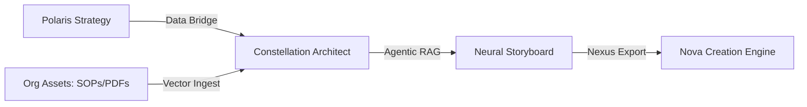

# 🏗️ Constellation System Design

## 1. High-Level Flow: The Architectural Bridge
Constellation operates as a high-fidelity translator between Strategic Intent and Production Content.

## 2. Component: Polaris Data Bridge
The Data Bridge is responsible for hydrating the Architecture Canvas with "High-Fidelity" blueprint data.

- **Primary Path**: `blueprint_generator.blueprint_json.content_outline.modules`
- **Logic**: Priority is given to AI-generated results. If `blueprint_json` is empty, the system falls back to `static_answers` and `dynamic_questions` to prevent UI breakage.
- **Mapping**:
  - `Objective`: Extracted from `executive_summary.content`.
  - `Persona`: Extracted from `target_audience.demographics.roles`.
  - `Sequence`: Mapped as "Strategic Nodes" in the Canvas.

## 3. Component: Asset Ingest Engine (Planned)
To ground instructional design in truth, users upload organizational source material.

- **Storage**: Assets are stored in Supabase Storage.
- **Chunking**: Large documents are split into semantic chunks (approx. 500-1000 tokens).
- **Embedding**: Google Gemini `text-embedding-004` model.
- **Vector Store**: `pgvector` on Supabase with HNSW indexing for sub-second retrieval.

## 4. Component: Instructional Architect (Agentic RAG)
The "Brain" of Constellation. For each selected node (Module), the engine:
1.  **Retrieves**: Finds the top 3-5 most relevant asset chunks from the Vector Store.
2.  **Synthesizes**: Passes the (Strategic Node Context + Organizational Asset Context) to Gemini 3.1 Pro.
3.  **Drafts**: Generates high-fidelity scripts, visual scene descriptions, and specific learning interactions.

## 5. UI Architecture: The Neural Canvas
The `ArchitectureCanvas` component is a high-density workspace designed for professionals.

- **Left Panel**: Polaris Reference (The "Why").
- **Center Panel**: Sequential Node Scroll (The "Structure").
- **Right Panel**: RAG Drafting Workspace (The "How").
- **Styling**: "Deep Space" theme (#020C1B) using custom MUI 7 Glassmorphism filters.
